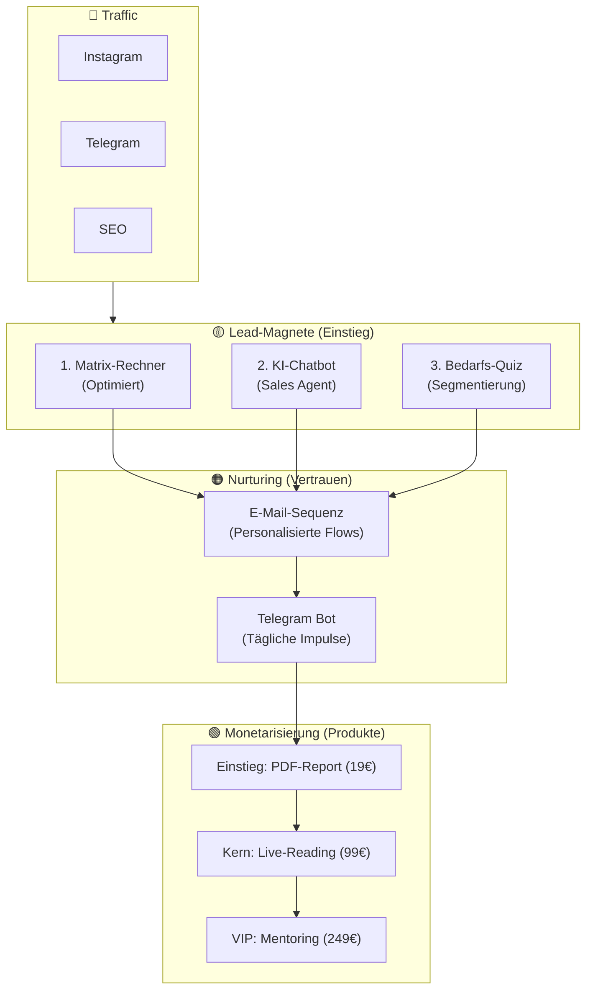

# 🦅 Masterplan: Numerologie PRO 2.0 Ecosystem

**Version:** 1.0 (Vereint aus 3 Analysen)
**Mission:** Bau eines vollautomatisierten Sales-Ökosystems, das rund um die Uhr Leads generiert, Vertrauen aufbaut und Swetlanas Beratungspakete verkauft.

---

## 1. 🌍 Das Ökosystem (Big Picture)

Das System verbindet **6 Kanäle** zu einer Maschine:

---

## 2. 🔢 Komponente 1: Der Ultimative Matrix-Rechner
*Status: MVP existiert. Ziel: Bester Rechner am Markt.*

Aus der **Konkurrenz-Analyse** wissen wir: Nur 1 von 4 Konkurrenten hat einen Rechner. Wir schlagen sie durch **Design & Tiefe**.

### 🛠️ Features & Optimierungs-Plan

| Prio | Feature | Warum? (Konkurrenz-Lehre) | Status |
|---|---|---|---|
| 🔴 **P1** | **PDF-Download** | Nutzer wollen Ergebnisse speichern. Viraler Effekt. | ⏳ To Do |
| 🔴 **P1** | **Teilbare URL / QR** | "Schau dir meine Matrix an!" = Kostenloser Traffic. | ⏳ To Do |
| 🔴 **P1** | **Zeilen/Spalten-Matrix** | Echter psychologischer Mehrwert (fehlt bei Konkurrenz). | ⏳ To Do |
| 🟡 **P2** | **Visuelles Grid** | Gold-Glow für volle Zellen. Visuelle Hierarchie. | ⏳ To Do |
| 🟢 **P3** | **Jahres-Forecast Teaser** | Einzigartiges Feature, macht neugierig auf mehr. | ⏳ To Do |

**Tech:** Next.js + Framer Motion (Frontend), `react-pdf` (Backend-Generierung).

---

## 3. 🤖 Komponente 2: KI-Chatbot (Der Verkäufer)
*Status: Konzept. Ziel: 24/7 Beratung & Sales.*

Aus der **Video-Analyse** (Everlast AI) leiten wir das "Hybrid-Modell" ab:

### 🧠 Strategie
1.  **Rolle:** "Swetlanas digitale Assistentin". Empathisch, numerologisch fundiert.
2.  **Funktion:** Beantwortet Fragen → Berechnet Matrix → Empfiehlt **passendes Paket**.
3.  **Wissen (RAG):** Datenbank mit Swetlanas Texten, Paket-Details, Preisen.

### ⚙️ Tech-Stack (Hybrid)
*   **Frontend:** Custom React Widget (für perfektes Gold/Dark Design).
*   **Brain:** n8n Workflow (Verwaltung des Wissens & Logik).
*   **Memory:** Supabase pgvector (Speicher für Embeddings).

### 🚦 Funnel-Logik im Chat
*   User fragt: *"Passen wir zusammen?"*
    *   Bot: *"Lass uns kurz eure Geburtsdaten schauen..."*
    *   Bot: *"Ihr habt eine karmische Verbindung (8). Hier hilft die **Beziehungskarte** weiter."*
    *   → Link zum 99€ Produkt.

---

## 4. 📱 Komponente 3: Telegram & Nurturing
*Status: Idee. Ziel: Tägliche Touchpoints.*

### Telegram Bot 2.0
*   **Funktion:** Sendet tägliche "Zahl des Tages" und Erinnerungen an Livestreams.
*   **Lead-Magnet:** "Starte den Bot für dein Gratis-Tages-Horoskop".
*   **Tech:** n8n Cronjob → Telegram API.

### E-Mail-Sequenzen (Automatisierung)
Automatische Mails basierend auf dem Einstiegspunkt:
1.  **Tag 0:** Willkommen + Gratis PDF (aus Rechner/Quiz).
2.  **Tag 2:** "Wusstest du, dass deine Schicksalszahl X bedeutet?" (Personalisierung).
3.  **Tag 5:** Angebot: "Dein komplettes schriftliches Portrait für nur 19€".
4.  **Tag 10:** Social Proof + Einladung zum Live-Reading (99€).

---

## 5. 💰 Komponente 4: Neue Produkte (Revenue Ladder)
Wir schließen die Lücke zwischen "Gratis" und "99€".

1.  **Numerologisches Portrait (19€)**
    *   Automatisch generiertes 15-Seiten PDF.
    *   Einstiegsprodukt (Tripwire).
    *   **Tech:** Template in React-PDF, Generierung on-the-fly.
2.  **Jahresprognose Deluxe (14€)**
    *   Detaillierter Kalender für 12 Monate.
3.  **Das große Live-Reading (99€)**
    *   Das bestehende Core-Produkt.
    *   Wird als "Premium-Upgrade" verkauft.

---

## 🗓️ Umsetzungs-Roadmap (Phasen)

### Phase 1: Foundation (Woche 1-2)
*   [ ] **Rechner P1:** PDF-Download & Share-URL einbauen.
*   [ ] **Rechner P1:** Zeilen/Spalten-Logik ergänzen.
*   [ ] **Chatbot MVP:** Widget auf Website + Basis-Antworten.

### Phase 2: Automation (Woche 3-4)
*   [ ] **E-Mail Setup:** Resend/Brevo anbinden. Sequenz schreiben.
*   [ ] **PDF-Produkt:** "Portrait" Template bauen & Stripe verbinden.
*   [ ] **Quiz-Page:** Bedarfsanalyse-Seite erstellen.

### Phase 3: Expansion (Woche 5-6)
*   [ ] **Telegram Bot:** Tägliche Impulse automatisieren.
*   [ ] **Rechner P2:** Visuelles Redesign & Animationen.
*   [ ] **Livestream-Funnel:** Automatische Erinnerungen.

---

## 🏁 Zusammenfassung
Dieses System verwandelt die Website von einer "Visitenkarte" in einen **aktiven Verkäufer**. Jeder Besucher wird abgeholt (Rechner/Bot), qualifiziert (Quiz), gebunden (Mail/Telegram) und monetarisiert (Produkte).
